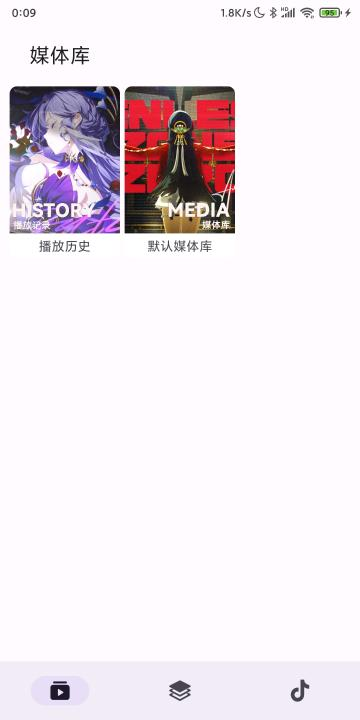
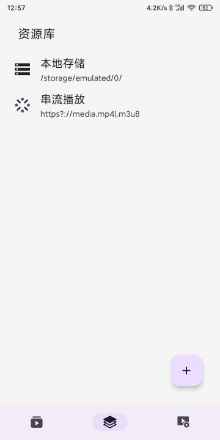
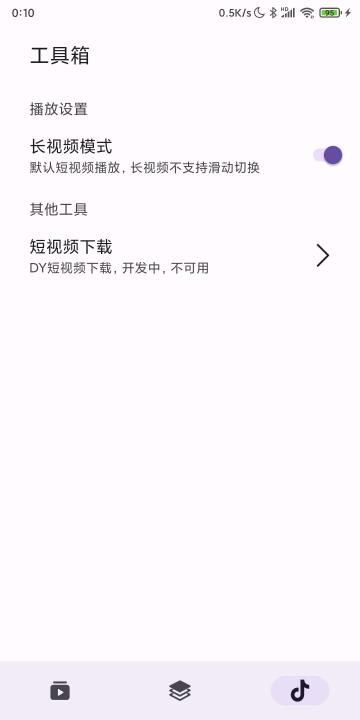
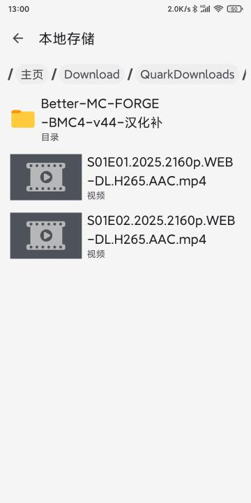
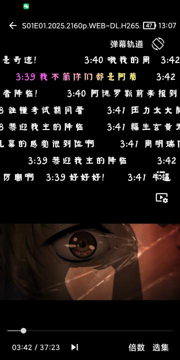
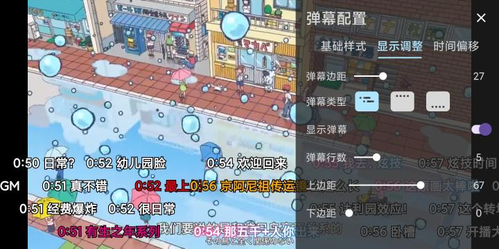
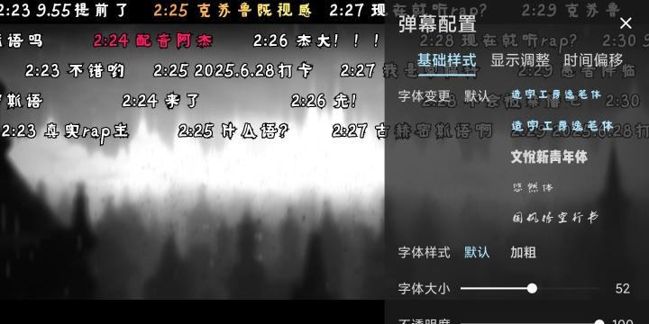

## DyLike  

支持长短视频的弹幕播放器，短视频上下滑动切换，随机播放，长视频弹幕装载，渐变色支持  

### 说明  

发得仓促，代码比较乱，而且问题较多，暂没有上传代码，经过一段时间整理，后续将上传  
基于ijk本地视频播放器，~~定位类抖音上下滑动切换播放的短视频应用~~，长短视频皆宜  
需手动切换长短视频模式，长视频支持加载本地弹幕，包含丰富的弹幕设置，  
支持本地视频及WebDav视频，WebDav实际为OpenList功能，Webdav仍需后续适配  
早期开发版本，部分功能尚未完善，长视频模式当前封装不支持字幕轨和音频轨切换  
受限于ijk内核，可能部分视频格式不兼容，可切换内核为EXO，现已支持  
以上问题如有时间和大量需求，可以通过迭代开发解决  

项目主页及下载链接：https://zhaohuaxs.github.io/dy-like.html   

### 功能  

当前功能：  
- [x] 短视频模式，上下滑动切换视频播放，上滑黑屏问题需要优化(切换exo解决)
- [x] 长视频模式，装载弹幕播放，支持b站描边渐变，支持企鹅文本渐变，依靠弹目APP调色  
- [x] 自定义WebDav（OpenList）资源库，不仅限于本地视频播放，同目录同名弹幕匹配后续支持
- [x] 设置长短视频模式，播放时无视全局设置自动进入对应模式
- [x] 支持设置webdav资源库目录为媒体库，暂不支持设置封面

计划功能：  
- [ ] 短视频合集，长按倍数，双指说法等等
- [ ] 弹幕倍数，webdav优化，音轨字幕轨支持等等   

### 截图  

### 感谢

[DKVideoPlayer](https://github.com/Doikki/DKVideoPlayer)  
[DanDanPlayForAndroid](https://github.com/xyoye/DanDanPlayForAndroid)  

### 后记  

有问题反馈，理解万岁  

反馈群：811806197  